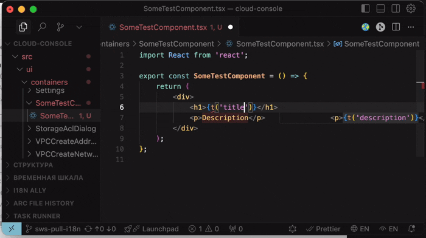
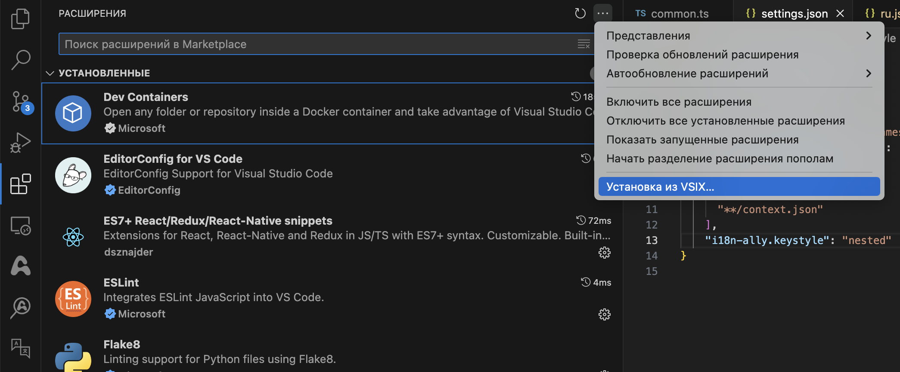
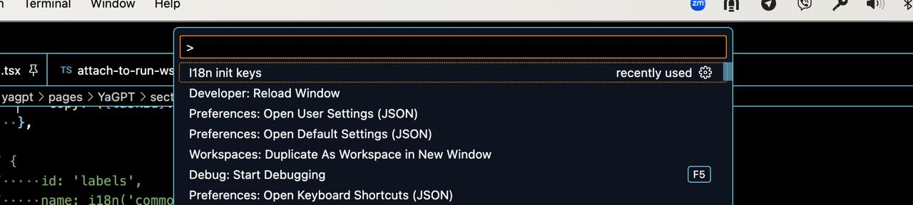

# i18n VS Code Extension

Simplifies creating `i18n.ts` localization files. Adds new keys to existing localization files.

## Installation

1. Download the extension in VSIX format by [link](./i18n-init-keys-0.0.1.vsix).

2. Install the extension in VS Code. `Extensions -> ... -> Install From VSIX`

    

3. In any file, open the VS Code console and call the command `I18n init keys`

    

4. Or click on the icon  in the top right corner above the code editor.

## Build

Run `npm run build`
